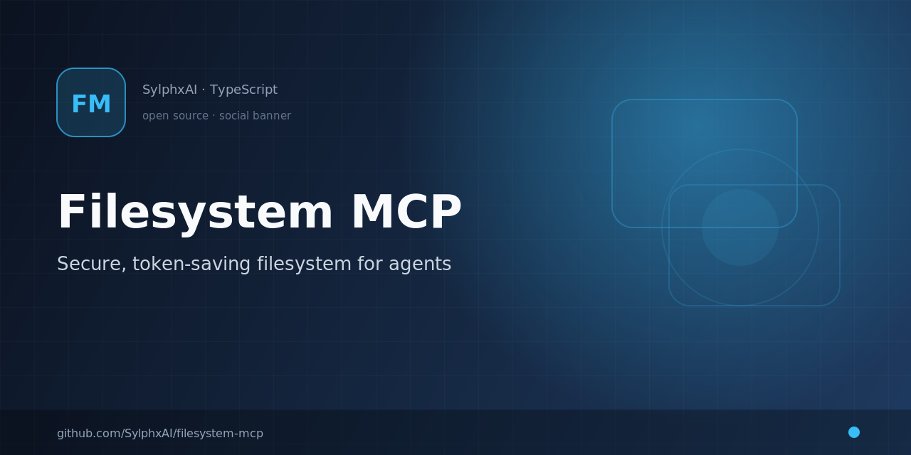

<div align="center">

# Filesystem MCP

<p align="center">
  
</p>


### Your agent touched the repo. **Did it stay in the project?**

Secure, token-optimized filesystem operations for AI agents — batch reads, surgical edits, and
project-root confinement without shell spawn overhead.

[](https://www.npmjs.com/package/@sylphx/filesystem-mcp)
[](https://hub.docker.com/r/sylphx/filesystem-mcp)
[](https://opensource.org/licenses/MIT)
[](https://www.typescriptlang.org/)

**Batch operations** · **Project root safety** · **Zod validation** · **13 MCP tools** · **Docker-ready**

[⭐ Star this repo](https://github.com/SylphxAI/filesystem-mcp) if agents should read and edit your codebase safely — not spawn shells per file.
· [Quick start](#quick-start) · [See it work](#see-it-work) · [Why not shell commands?](#why-not-shell-commands)
· [Roadmap](docs/roadmap/sota-family-roadmap.md)

<a href="https://glama.ai/mcp/servers/@sylphx/filesystem-mcp">
  
</a>

</div>

---

## The problem

Agents need filesystem access to read code, apply edits, and search across a repo. The default
path is **shell commands** — one spawn per operation, no batching, stderr parsing, and paths
that can wander outside the project.

That costs tokens, adds latency, and turns every file touch into a trust exercise.

**Filesystem MCP is built for the moment your agent needs fast, bounded, batch-friendly file
operations — confined to the project root.**

## Why not shell commands?

| Shell commands per file | Filesystem MCP |
| --- | --- |
| One operation per spawn | Batch 10+ files in one MCP call |
| Full shell access | Confined to server `cwd` at launch |
| stderr parsing | Per-item success/failure in structured JSON |
| High token round trips | Fewer host↔server calls |
| Path traversal risk | Relative paths only; traversal blocked |
| No schema | Zod-validated arguments on every tool |

Full benchmark contract: [docs/benchmark.md](docs/benchmark.md).

## See it work

**Configure once. Read many files in one call.**

```bash
claude mcp add filesystem -- npx @sylphx/filesystem-mcp
```

```json
{
  "paths": ["src/index.ts", "package.json", "README.md"]
}
```

`read_content` returns per-file results in one response:

```json
{
  "results": [
    { "path": "src/index.ts", "content": "...", "success": true },
    { "path": "package.json", "content": "...", "success": true },
    { "path": "README.md", "content": "...", "success": true }
  ]
}
```

**Important:** launch the MCP server with `cwd` set to your project root. All paths are relative
to that directory.

## Why agents use it

| Need | What you get |
| --- | --- |
| Read multiple files | `read_content` — batch paths, optional line ranges |
| Write or append | `write_content` — multiple files per call |
| Surgical edits | `apply_diff`, `replace_content` — diff output and per-file status |
| Search the tree | `search_files` — regex with context |
| Refactor across files | `replace_content` — multi-file search & replace |
| Explore structure | `list_files` — recursive listing with optional stats |
| Move/copy/delete | `move_items`, `copy_items`, `delete_items` |
| Permissions | `chmod_items`, `chown_items` |
| Inspect metadata | `stat_items`, `create_directories` |

## Quick Start

### Claude Code

```bash
claude mcp add filesystem -- npx @sylphx/filesystem-mcp
```

Run from your project directory so `cwd` is the repo root.

### Claude Desktop / any MCP host

```json
{
  "mcpServers": {
    "filesystem-mcp": {
      "command": "npx",
      "args": ["@sylphx/filesystem-mcp"]
    }
  }
}
```

Set the host's working directory to your project root.

### Docker

```json
{
  "mcpServers": {
    "filesystem-mcp": {
      "command": "docker",
      "args": [
        "run", "-i", "--rm",
        "-v", "/path/to/your/project:/app",
        "sylphx/filesystem-mcp:latest"
      ]
    }
  }
}
```

### Local development

```bash
git clone https://github.com/SylphxAI/filesystem-mcp.git
cd filesystem-mcp
bun install
bun run build
bun run test
```

## MCP Tool Surface

| Tool | Use it when the agent needs to... |
| --- | --- |
| `read_content` | Read one or more files (optional line ranges) |
| `write_content` | Write or append to files |
| `apply_diff` | Apply structured diffs across files |
| `search_files` | Regex search with context lines |
| `replace_content` | Multi-file search and replace |
| `list_files` | List a directory tree (optional stats) |
| `stat_items` | Get detailed file/directory metadata |
| `create_directories` | Create directories (with parents) |
| `delete_items` | Remove files or directories |
| `move_items` | Move or rename items |
| `copy_items` | Copy files or directories |
| `chmod_items` | Change POSIX permissions |
| `chown_items` | Change ownership |

## Release proof

Claims are backed by CI `benchmark:release-gate`, safety fixture corpus, and the shipped-path matrix (Rust-default primary tools).

```bash
bun run benchmark:release-gate
```

Artifact: `benchmark-artifacts/filesystem_release_gate.json` — must report `status: passed` before release.

## Performance benchmarks

Reproduce local throughput on the **shipped Rust CLI path**:

```bash
bunx vitest bench __tests__/benchmarks/throughput.bench.ts --run
```

See [docs/benchmark.md](docs/benchmark.md) for scenarios, design goals, and how to interpret results.

## Security model

- All operations confined to the server `cwd` at launch.
- Absolute paths rejected; path traversal blocked.
- Zod schemas validate every tool argument.
- Batch tools return per-item status — one failure does not hide the rest.

## Documentation

| Topic | Link |
| --- | --- |
| Docs site | [sylphxai.github.io/filesystem-mcp](https://sylphxai.github.io/filesystem-mcp/) |
| Introduction | [docs/guide/introduction.md](docs/guide/introduction.md) |
| Benchmarks | [docs/benchmark.md](docs/benchmark.md) |

## Development

```bash
bun run validate    # lint + typecheck + test
bun run docs:build  # VitePress + API docs
bun run benchmark   # vitest bench
```

## Support

- [Issues](https://github.com/SylphxAI/filesystem-mcp/issues)
- [Discussions](https://github.com/SylphxAI/filesystem-mcp/discussions)
- [npm package](https://www.npmjs.com/package/@sylphx/filesystem-mcp)

## Help this reach more builders

If shell-per-file agent workflows have burned your tokens or your trust in path safety, this
project is for you.

**[⭐ Star the repo](https://github.com/SylphxAI/filesystem-mcp)** — it helps more agent builders
find secure, batch-friendly filesystem access.

### Discovery (in progress)

| Channel | Status |
| --- | --- |
| [Glama MCP directory](https://glama.ai/mcp/servers/@sylphx/filesystem-mcp) | Listed — [claim server](https://glama.ai/mcp/servers/@sylphx/filesystem-mcp/admin) for full discoverability |
| [Official MCP Registry](https://registry.modelcontextprotocol.io/) | Not listed yet |
| [mcp.so submit](https://mcp.so/submit) | Not listed yet — directory submission |
| [mcpservers.org submit](https://mcpservers.org/submit) | Not listed yet — free web-form submission |

Know another MCP directory? [Open an issue](https://github.com/SylphxAI/filesystem-mcp/issues/new) with the link.

## License

MIT © [Sylphx](https://sylphx.com)